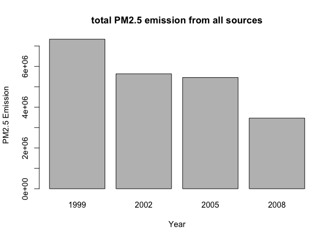
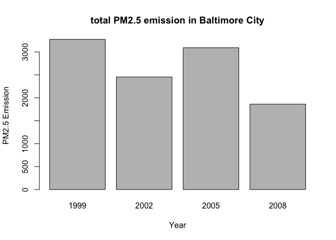
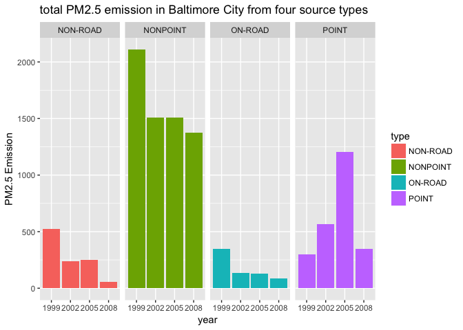
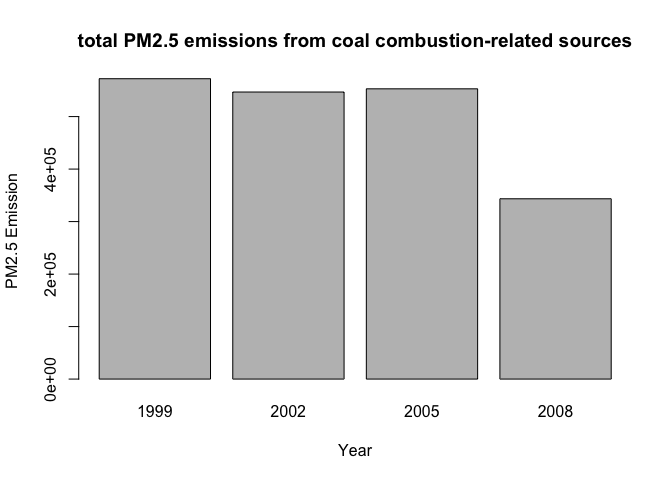
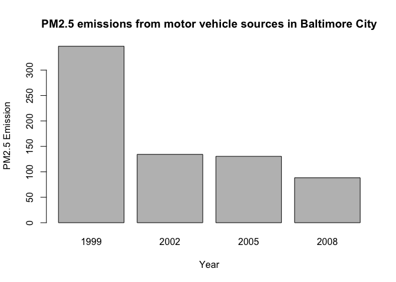
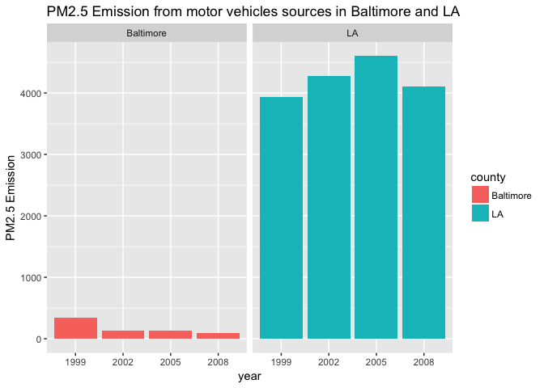

0. Loading and processing data

```r
NEI <- readRDS("summarySCC_PM25.rds")
SCC <- readRDS("Source_Classification_Code.rds")
```

1. Have total emissions from PM2.5 decreased in the United States from 1999 to 2008? 

```r
total.emissions <- with(NEI,tapply(Emissions,year,sum))
barplot(total.emissions,xlab="Year",ylab="PM2.5 Emission",main="total PM2.5 emission from all sources")
```

<!-- -->

2. Have total emissions from PM2.5 decreased in the Baltimore City, Maryland (𝚏𝚒𝚙𝚜 == "𝟸𝟺𝟻𝟷𝟶") from 1999 to 2008?

```r
NEI.baltimore <- subset(NEI,fips=="24510")
toem.baltimore <- with(NEI.baltimore,tapply(Emissions,year,sum))
barplot(toem.baltimore,xlab="Year",ylab="PM2.5 Emission",main="total PM2.5 emission in Baltimore City")
```

<!-- -->

3.Of the four types of sources indicated by the 𝚝𝚢𝚙𝚎 (point, nonpoint, onroad, nonroad) variable, which of these four sources have seen decreases in emissions from 1999–2008 for Baltimore City? Which have seen increases in emissions from 1999–2008?

```r
library("dplyr")
```

```
## 
## Attaching package: 'dplyr'
```

```
## The following objects are masked from 'package:stats':
## 
##     filter, lag
```

```
## The following objects are masked from 'package:base':
## 
##     intersect, setdiff, setequal, union
```

```r
emission.byyeartype <- group_by(NEI.baltimore,year,type)%>%summarise(Emissions=sum(Emissions))
library("ggplot2")
ggplot(emission.byyeartype, aes(x=factor(year), y=Emissions, fill=type)) + 
      geom_bar(stat="identity")+facet_grid(. ~ type) + 
      xlab("year") + 
      ylab("PM2.5 Emission") + 
      ggtitle("total PM2.5 emission in Baltimore City from four source types")
```

<!-- -->

4. Across the United States, how have emissions from coal combustion-related sources changed from 1999–2008?

```r
coal.combustion <- grepl("Fuel Comb.*Coal",SCC$EI.Sector)
SCC.Coal <- SCC[coal.combustion,]
NEI.Coal <- NEI[NEI$SCC %in% SCC.Coal$SCC,]
total.emission.coal <- with(NEI.Coal,tapply(Emissions,year,sum))
barplot(total.emission.coal,xlab="Year",ylab="PM2.5 Emission",main="total PM2.5 emissions from coal combustion-related sources")
```

<!-- -->

5. How have emissions from motor vehicle sources changed from 1999–2008 in Baltimore City?

```r
motor.vehicle <- grepl("Mobile.*Vehicles",SCC$EI.Sector)
SCC.vehicle <- SCC[motor.vehicle,]
NEI.baltimore.vehicle <- NEI.baltimore[NEI.baltimore$SCC %in% SCC.vehicle$SCC,]
total.emission.vehicle <- with(NEI.baltimore.vehicle,tapply(Emissions,year,sum))
barplot(total.emission.vehicle,xlab="Year",ylab="PM2.5 Emission",main="PM2.5 emissions from motor vehicle sources in Baltimore City")
```

<!-- -->

6. Compare emissions from motor vehicle sources in Baltimore City with emissions from motor vehicle sources in Los Angeles County, California (𝚏𝚒𝚙𝚜 == "𝟶𝟼𝟶𝟹𝟽"). Which city has seen greater changes over time in motor vehicle emissions?

```r
NEI.baltimoreLA <- subset(NEI,fips=="24510"|fips=="06037")
NEI.baltimoreLA.vehicle <- NEI.baltimoreLA[NEI.baltimoreLA$SCC %in% SCC.vehicle$SCC,]
emission.byyearfips <- group_by(NEI.baltimoreLA.vehicle,year,fips)%>%summarise(Emissions=sum(Emissions))
emission.byyearfips$county <- rep(c("LA","Baltimore"),4)
ggplot(emission.byyearfips, aes(x=factor(year), y=Emissions, fill=county)) + 
      geom_bar(stat="identity")+
      facet_grid(. ~ county) + 
      xlab("year") + 
      ylab("PM2.5 Emission") + 
      ggtitle("PM2.5 Emission from motor vehicles sources in Baltimore and LA")
```

<!-- -->
